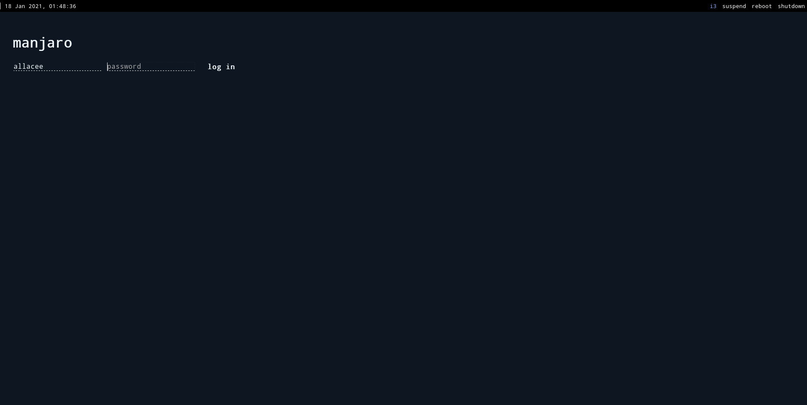
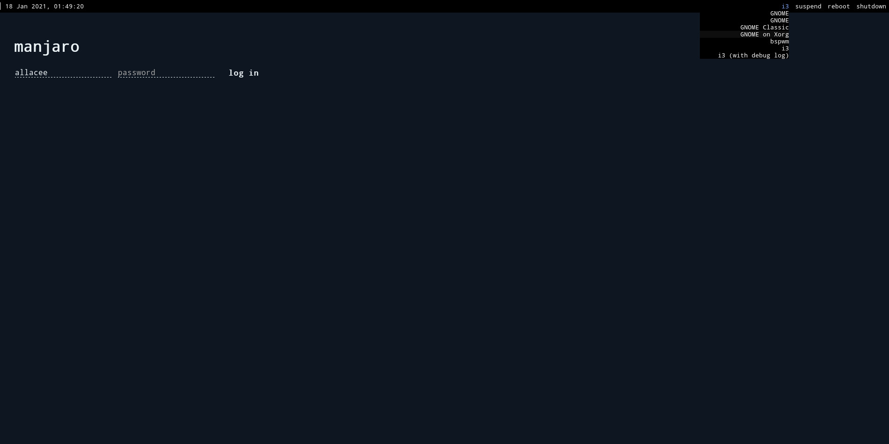

# Minimalistic lightdm-webkit2-greeter theme

## Simple theme for lightdm display manager with webkit2 greeter.

### Installation

This is a theme for [web greeter](https://github.com/Antergos/web-greeter) therefore that must be installed first.

1. `git clone https://github.com/dimaglushkov/lightdm-webkit2-theme-minimal`
1. `cd lightdm-webkit2-theme-minimal`
1. `sudo ./install.sh`
1. Set this theeme as greeter theme by adding `webkit_theme=minimal` to `/etc/lightdm/lightdm-webkit2-greeter.conf`
1. Set webkit2 greeter as your greeter by adding `greeter-session=lightdm-webkit2-greeter` to `/etc/lightdm/lightdm.conf`

### Requirements

-   [lightdm](https://github.com/canonical/lightdm)
-   [web greeter](https://github.com/Antergos/web-greeter)
